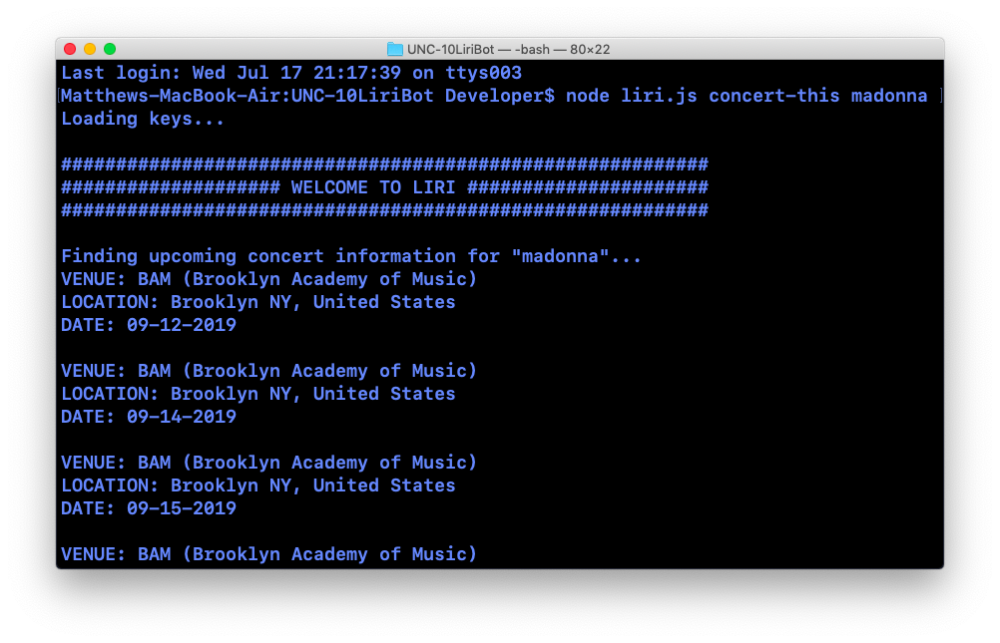
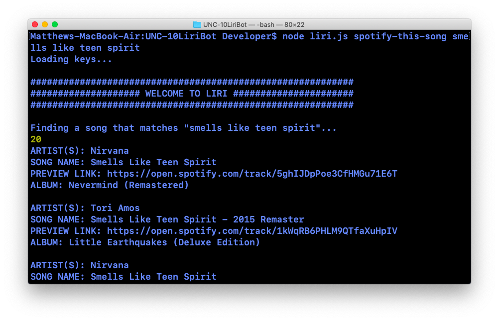
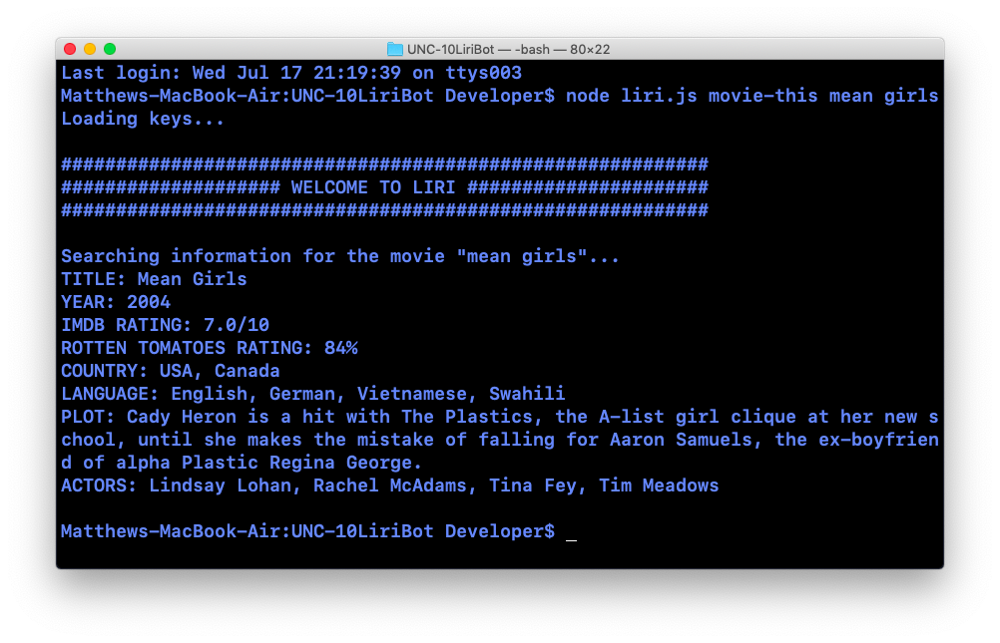
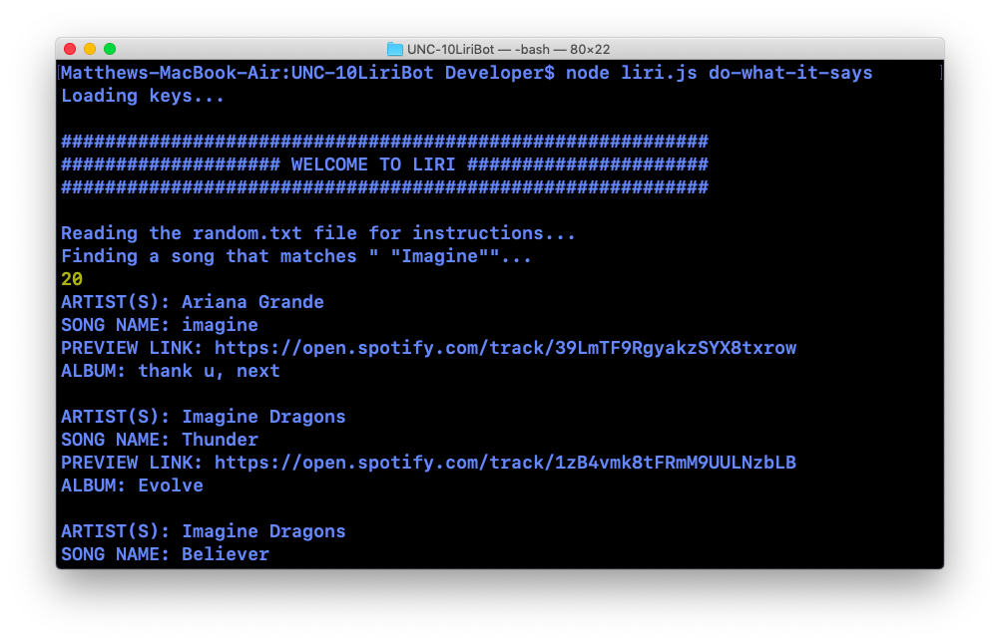

# LIRI Bot
## UNC Assignment #10

### Created by Matthew Farmer
__________________________________________________________________________________

### About
LIRI Bot is a command-line node application designed to allow users to search for information on songs, movies, and concerts.

### Concert Search

> node liri.js concert-this (artistName)

This feature uses the BandsInTown API to search for upcoming concerts for a given artist. Data returned includes the venue name, venue location, and date of the concert.

### Song Search

> node liri.js spotify-this-song (songName)

This feature uses the Spotify API to search for songs that match a given song title. Data returned includes the name of the artist(s), song name, a preview link on Spotify, and the album from which the song originates.

### Movie Search

> node liri.js movie-this (movieName)

This feature uses the OMDB API to search for a movie that matches a given movie title. Data returned includes the title of the movie, the year the movie was released, the movie's country of origin, languages in which the movie is available, a brief summary of the plot, and a list of the main actors in the film.

### Read Instructions from File

>node liri.js do-what-it-says

This feature allows instructions from the 'random.txt' file to be performed using one of the three other functions (concert search, song search, or movie search). For example, the user may change the text inside 'random.txt' to read 'movie-this, Titanic' and run the application using 'node liri.js do-what-it-says' on the command line. LIRI Bot will then return information on the movie 'Titanic' using the movie search function.
